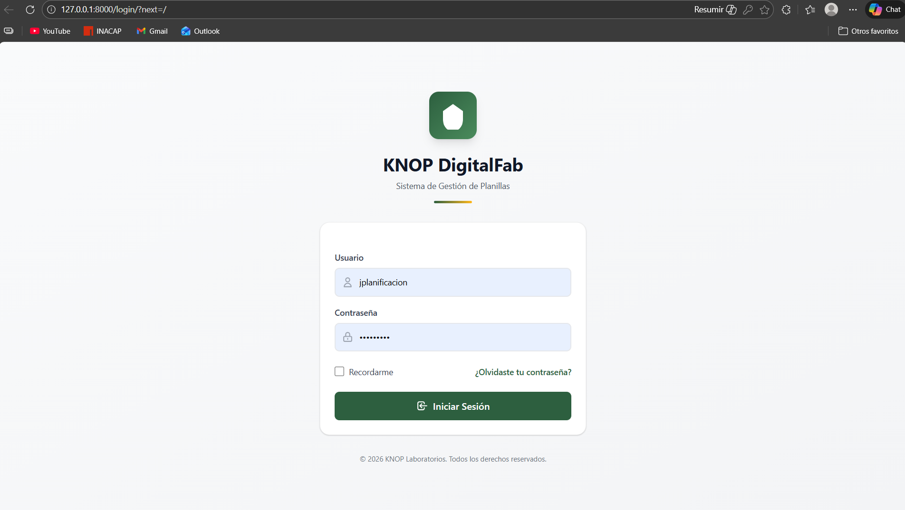
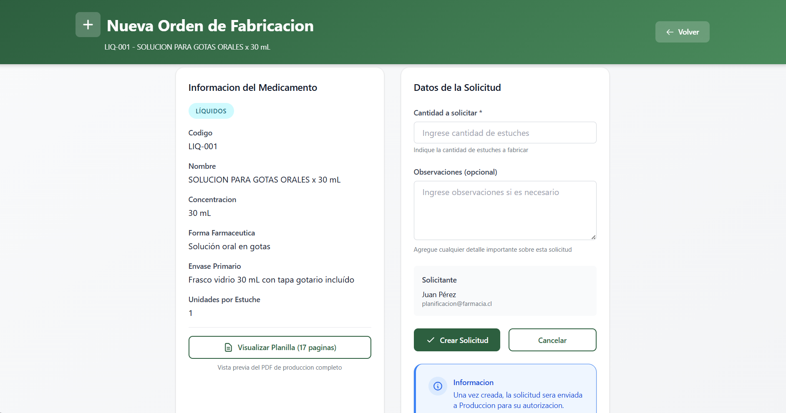
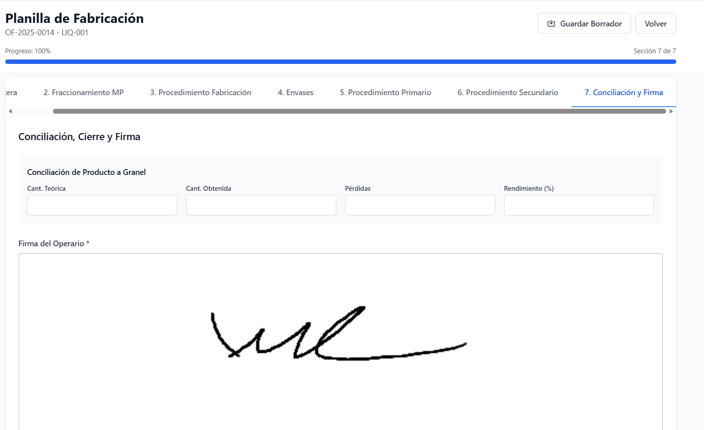
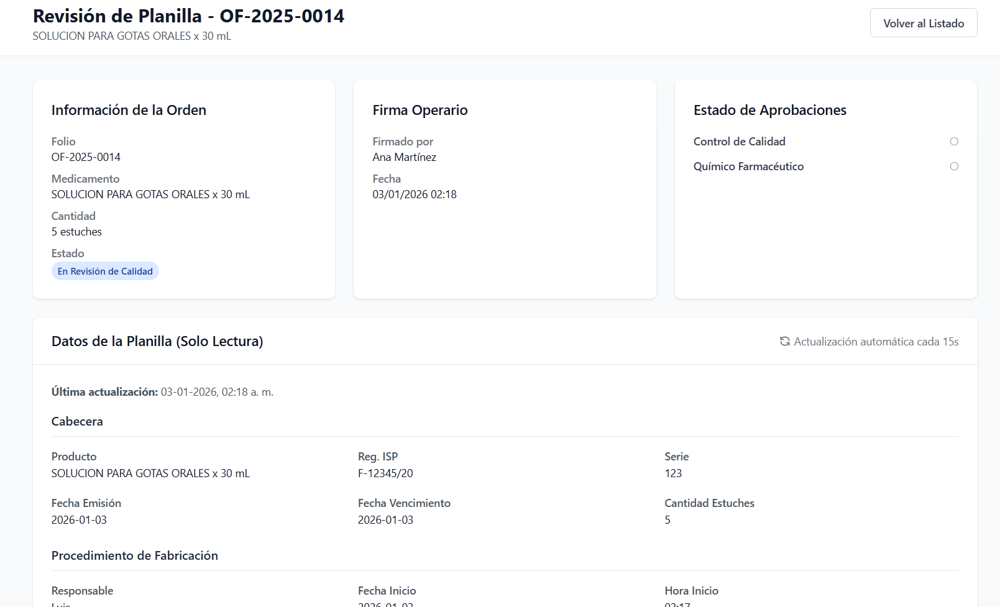

# Evidencias del sistema KNOP

En esta sección se presentan capturas de pantalla y diagramas del sistema de digitalización de planillas de fabricación para KNOP Laboratorios.  
Las imágenes muestran los principales módulos, flujos operativos y controles del sistema.

---

## Diagrama BPMN del proceso

Representación del flujo completo del proceso productivo en el sistema, desde la solicitud de fabricación hasta el cierre y control de calidad.

---

## Autenticación y control de acceso

Pantalla de inicio de sesión del sistema, con control de acceso según perfil de usuario.

---

## Solicitud de fabricación

Registro inicial de la orden de fabricación, dando inicio al flujo del proceso productivo.

---

## Autorización y rechazo de órdenes

Módulo de validación donde se revisan y aprueban o rechazan órdenes según criterios definidos.

---

## Relleno de planilla de producción

Ingreso de datos operativos durante la ejecución del proceso de fabricación.

---

## Inspección de calidad

Revisión por el área de calidad, asegurando cumplimiento de estándares y trazabilidad.

---

## Vista de administración

Panel administrativo para gestión de usuarios, roles y control general del sistema.
